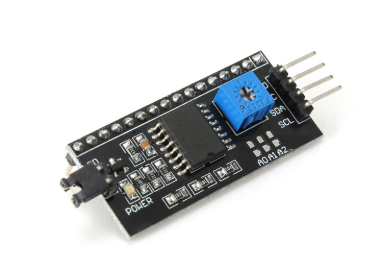
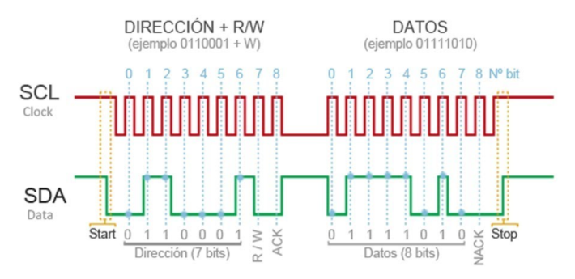
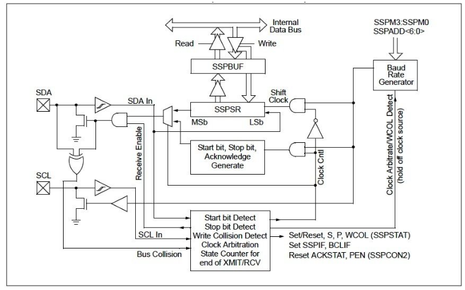
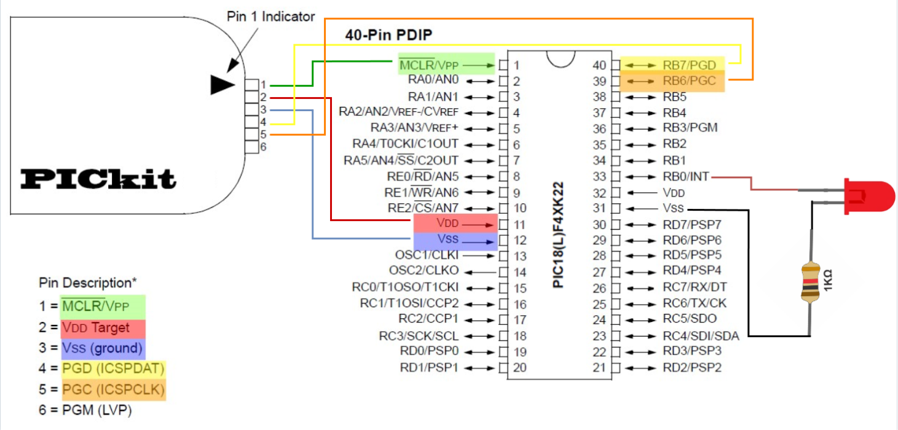
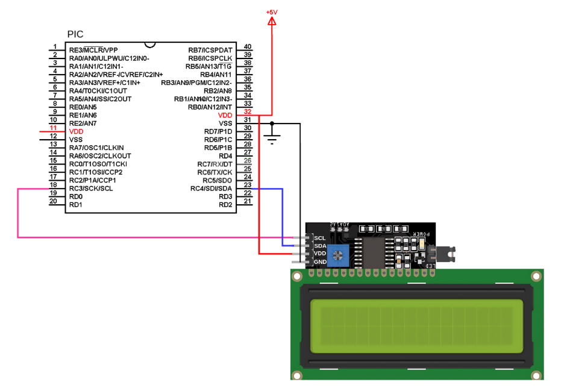

# Lab07: Visualización en LCD 16x2 usando módulo I²C con microcontrolador PIC

## Integrantes

* [Laura Alejandra Fuentes Ubaque](https://github.com/LauraAlejandraFuentes)
* [Juan Sebastian Guerrero Gualteros](https://github.com/juanseguerrerogu07)
* [Pedro Felipe Jimenez Celis](https://github.com/pedrofejimenezce-ship-it)
* [Samuel Corro Pedrozo](https://github.com/SamuelCorro)

## Documentación

**1. Objetivos de aprendizaje**

1.Configurar el modulo I²C (MSSP) del PIC18F45K22 en modo maestro

2.Comunicar el PIC con una LCD 16x2 utilizando el adaptador basado en PCF8574

3.Implementar funciones para enviar comandos y caracteres vía  I²C

4.Mostrar mensajes en la pantalla LCD desde el programa principal

**2.Materiales**

1.PIC18F45K22

2.Programador/debugger PICkit 4

3.Fuente de alimentación (o PICkit 4)

4.LCD 16X2

5.Módulo I²C PCF8574

6.Entorno de programación MPLAB X IDE con compilador XC8

**3.Fundamento teórico**

**I²C** es un protocolo de comunicación serial de dos hilos que utiliza una línea de datos serial (SDA) y una línea de reloj (SCL).

Este protocolo permite múltiples dispositivos esclavos (o periféricos) en el mismo bus de comunicación, y también puede soportar múltiples maestros que envién y reciban comandos y datos.

**I²C** es una comunicación **half-duplex**, donde solo un controlador o un dispositivo objetivo envía datos por el bus en un momento dadoo. En comparación, la Interfaz Periférica Serial(**SPI**) es un protocolo **full-duplex**, donde se pueden enviar y recibir datos simultáneamente. SPI requiere cuatro lineas para la comunicación: dos lineas de datos utilizadas para enviar y recibir información hacia y desde el dispositivo objetivo. Además de la línea de reloj serial, se emplea una línea de chip select única para seleccionar el dispositivo con el que se desea comunicar, junto con las dos líneas de datos usadas para la entrada y salida del dispositivo.

La comunicación se transmite en paquetes de bytes, con una dirección única para cada dispositivo esclavo.

La siguiente figura muestra la estructura de una transferencia típica en el bus I²C, donde se observa la condición de inicio, el envío de la dirección del dispositivo con el bit de lectura/escritura, el bit de reconocimiento (ACK) y finalmente la transmisión de datos seguida de la condición de parada.

La pantalla LCD 16X2 se controlará en este laboratorio mediante el protocolo **I²C** utilizando un expansor de puertos **PCF8574**. Este enfoque reduce la cantidad de pines necesarios para la conexión, ya que utiliza únicamente dos líneas: SDA (datos) y ´´´SCL´´´ (reloj).

El PIC18F45K22 cuenta con el módulo **MSSP** (Master Synchronous Serial Port), capaz de trabajar en protocolos **SPI** e **I²C**

El siguiente diagrama representa el funcionamiento interno del módulo MSSP configurado en modo **I²C**

Incluye:

➤ Buffers de transmisión y recepción (SSBUF y SSPSR)

➤ Detectores de Start/Stop, ACK, colisiones

➤ Control de reloj (Clock Gen)

➤ Generador de baudios

➤ Lógica para habilitar SDA y SCL

➤ Flags y registros de control (SSPCON1, SSPCON2, SSPSTAT, PIR1bits.SSPIF)

Entonces, en este laboratorio se usa en modo **I²C** Maestro para enviar datos al módulo LCD **PCF8574**

El módulo **PCF8574** suele tener una dirección base de 7 bits igual a 0 x 27. Sin embargo, en el protocolo **I²C**, la dirección que se transmite al bus debe tener 8 bits, donde el último bit indica si se va a leer (1) o escribir (0). Como en este caso solo se realiza escritura hacia el LCD, la dirección efectiva enviada es 0 x 4E, que resulta de desplazar 0 x 27 una posición a la izquierda ( 0 x 27 << 1). Esta dirección ya se encuentra definida en el código como:

 #define LCD_ADDR 0x4E

**¿Por qué usar I²C con la LCD?** 
 
  Sin I²C → la LCD requiere 6 a 8 pines del microcontrolador.

Con I²C → solo se requieren 2 pines: SCL (RC3) y SCL (RC4).

**EXPLICACION DE LOS CODIGOS**

## Diagramas

Conexión PIC18F45K22 con PICkit 4

Diagrama de montaje 

## Evidencias de implementación

[video simulacion I2C](https://youtu.be/3he64MFGGu8)

## Preguntas

1. ¿Por qué I²C se clasifica como half-duplex mientras que SPI es full-duplex? ¿Qué implicación práctica tiene esa diferencia para el control de una LCD?.
2. En I2C_init() se asigna SSPCON1 = 0x28. Desglose ese valor bit a bit e identifique qué modo de operación del MSSP se está seleccionando y por qué se elige ese valor.
3. Las funciones I2C_start(), I2C_stop() e I2C_write() comparten el mismo patrón: activar un bit de control y luego esperar con while(!PIR1bits.SSPIF). ¿Qué representa la bandera SSPIF y por qué se limpia después de cada operación?.
4. El fuse PBADEN = OFF está presente en la configuración. ¿Qué efecto tendría dejarlo en ON sobre los pines del puerto B, y por qué podría causar problemas si se usan esos pines como salidas digitales?.
5. Compare el control de la LCD en modo paralelo (lab04) con el modo I²C de este laboratorio. Mencione ventajas y desventajas de cada enfoque en términos de: cantidad de pines usados, velocidad de actualización y complejidad del código.
6. El bus I²C permite conectar múltiples esclavos con solo dos hilos. Si se quisiera agregar un segundo módulo PCF8574 al mismo bus (por ejemplo, para controlar un segundo LCD), ¿qué cambio mínimo sería necesario en el hardware y en el código?

## Conclusiones

## Referencias